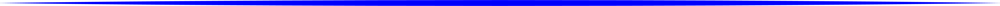

## Main Features

  - Thoroughly tested code base
  - Compatible with <b>any python machine-learning framework</b>
  - Optimize:
    - Anything from [simple models](#/./examples/sklearn_examples?id=sklearn) <br/> to complex [machine-learning-pipelines](#/./examples/sklearn_pipeline_example?id=sklearn-pipeline)
    - Multi-level [ensembles](#/./examples/stacking_example?id=stacking)
    - [Deep neural network](#/./examples/cnn_structure?id=keras-cnn-structure) architecture
    - Other [optimization techniques](./docs/examples.md) (meta-optimization)
    - Or [any function](./docs/examples.md) you can specify with this API
  - Utilize state of the art [optimization techniques](#/./optimizers/README?id=optimization-techniques) like:
    - Simulated annealing
    - Evolution strategy
    - Bayesian optimization
  - [High performance](#/./performance/README?id=performance): Optimizer time is neglectable for most models
  - Choose from a variety of different [optimization extensions](#/./extentions/README?id=optimization-extensions) to improve the optimization

<br>

<br>

<table>
  <tbody>
    <tr align="center" valign="center">
      <td>
        <strong>Optimization Techniques</strong>
        
      </td>
      <td>
        <strong>Tested and Supported Packages</strong>
        
      </td>
      <td>
        <strong>Optimization Extentions</strong>
        
      </td>
    </tr>
    <tr/>
    <tr valign="top">
      <td>
        <a><b>Local Search:</b></a>
          <ul>
            <li><a href="#/./optimizers/local_search?id=Hill-Climbing">Hill Climbing</a></li>
            <li><a href="#/./optimizers/local_search?id=stochastic-hill-climbing">Stochastic Hill Climbing</a></li>
            <li><a href="#/./optimizers/local_search?id=tabu-search">Tabu Search</a></li>
         </ul><br>
        <a><b>Random Methods:</b></a>
          <ul>
            <li><a href="#/./optimizers/random_methods?id=random-search">Random Search</a></li>
            <li><a href="#/./optimizers/random_methods?id=random-restart-hill-climbing">Random Restart Hill Climbing</a></li>
            <li><a href="#/./optimizers/random_methods?id=random-annealing">Random Annealing</a> [<a href="#/./overview#experimental-algorithms">*</a>] </li>
         </ul><br>
        <a><b>Markov Chain Monte Carlo:</b></a>
          <ul>
            <li><a href="#/./optimizers/mcmc?id=simulated-annealing">Simulated Annealing</a></li>
            <li><a href="#/./optimizers/mcmc?id=stochastic-tunneling">Stochastic Tunneling</li>
            <li><a href="#/./optimizers/mcmc?id=parallel-tempering">Parallel Tempering</a></li>
          </ul><br>
        <a><b>Population Methods:</b></a>
          <ul>
            <li><a href="#/./optimizers/population_methods?id=particle-swarm-optimization">Particle Swarm Optimizer</li>
            <li><a href="#/./optimizers/population_methods?id=evolution-strategy">Evolution Strategy</a></li>
          </ul><br>
        <a><b>Sequential Methods:</b></a>
          <ul>
            <li><a href="#/./optimizers/sequential_methods?id=bayesian-optimization">Bayesian Optimization</a></li>
          </ul>
      </td>
      <td>
        <a><b>Machine Learning:</b></a>
          <ul>
              <li><a href="#/./examples/machine_learning?id=sklearn">Scikit-learn</a></li>
              <li><a href="#/./examples/machine_learning?id=xgboost">XGBoost</a></li>
              <li><a href="#/./examples/machine_learning?id=lightgbm">LightGBM</a></li>
              <li><a href="#/./examples/machine_learning?id=catboost">CatBoost</a></li>
              <li><a href="#/./examples/machine_learning?id=rgf">RGF</a></li>
              <li><a href="#/./examples/machine_learning?id=mlxtend">Mlxtend</a></li>
          </ul><br>
        <a><b>Deep Learning:</b></a>
          <ul>
              <li><a href="#/./examples/deep_learning?id=tensorflow">Tensorflow</a></li>
              <li><a href="#/./examples/deep_learning?id=keras-cnn">Keras</a></li>
              <li>Pytorch</li>
          </ul><br>
        <a><b>Distribution:</b></a>
          <ul>
              <li><a href="#/./examples/distribution?id=multiprocessing">Multiprocessing</a></li>
              <li>Ray</li>
          </ul>
      </td>
      <td>
        <a><b>Position Initialization:</b></a>
          <ul>
            <li><a href="#/./examples/extensions?id=scatter-initialization">Scatter-Initialization</a> [<a href="#/./overview#experimental-algorithms">*</a>] </li>
            <li><a href="#/./examples/extensions?id=warm-start">Warm-start</a></li>
            <li>Meta-Learn (coming soon)</li>
          </ul><br>
        <a><b>Resource Allocation:</b></a>
          <ul>
            <li><a href="#/./examples/extensions?id=memory">Memory</a></li>
            <li>Proxy Datasets [<a href="#/./overview#references">1</a>]
 (coming soon)</li>
          </ul>
      </td>
    </tr>
  </tbody>
</table>

!> **Disclaimer:** The classification into the categories above is not necessarly scientifically accurate, but aims to provide an idea of the functionality of the methods.

## Installation Options

**Cypher (stable) is available on PyPi:**

```bash
pip install cypher
```

<br>

**Cypher (master) from Github:**

```bash
git clone https://github.com/TanishShinde/Cypher.git
pip install Cypher/
```

<br>

**Cypher (dev version) from Github:**

```bash
git clone https://github.com/TanishShinde/Cypher/tree/dev.git
pip install Cypher/
```

<br><br>

#### Experimental Algorithms

?> **Disclaimer:** The following algorithms are of my own design and, to my knowledge, do not yet exist in the technical literature.
If any of these algorithms already exist I would like to ask you to share it with me in an issue.

**Random Annealing**

A combination between simulated annealing and random search.

**Scatter Initialization**

Inspired by hyperband optimization.

<br>

#### References

#### [1] [Proxy Datasets for Training Convolutional Neural Networks](https://arxiv.org/pdf/1906.04887v1.pdf)

<br>

#### License

[](https://github.com/TanishShinde/Cypher/blob/master/LICENSE)
